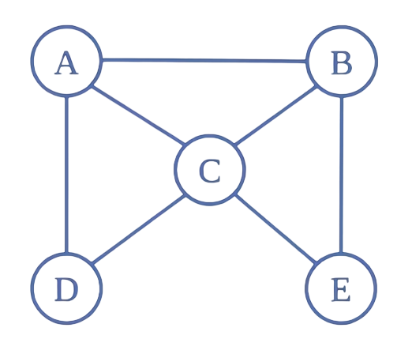

<p align="center">
  
</p>

<h1 align="center">CSC263-in-C</h1>

<p align="center">
  <sub>Click a language below to expand it — <a href="#chinese">中文点这里展开</a></sub>
</p>

C implementations of the data structures and algorithms covered in **CSC263H1: Data Structures and Analysis** (University of Toronto).

<details open>
<summary><b>English</b></summary>

## Topics

Based on the course's lecture notes, organized by week (Weeks 1-11). Checked items have an implementation in this repo.

1. [x] Week 1 — Complexity
   - Asymptotic notation
   - Worst-case vs. average-case analysis
2. [x] Week 2 — Priority Queues and Heaps
   - Binary heap (array-based)
   - Heap sort
3. [ ] Week 3 — Dictionaries and Binary Search Trees
   - BST insert/search/delete
   - Successor
4. [ ] Week 4 — AVL Trees and Augmented Data Structures
   - Rotations
   - Balance factor
5. [ ] Week 5 — Hash Tables
   - Chaining
   - Open addressing (linear/quadratic/double hashing)
6. [ ] Week 6 — Amortized Analysis
   - Dynamic arrays
   - Aggregate/accounting methods
7. [ ] Week 7 — Disjoint Sets
   - Union-by-rank
   - Path compression
8. [ ] Week 8 — Graphs and BFS
   - Adjacency list/matrix
   - Shortest paths
9. [ ] Week 9 — DFS
   - Topological sort
   - Strongly connected components
10. [ ] Week 10 — Minimum Spanning Trees
    - Kruskal's
    - Prim's
11. [ ] Week 11 — Randomized Quick Sort

## Building

Each implementation is a standalone C project. From within a topic's folder:

```sh
clang -g main.c pq.c -o pq_demo
./pq_demo
```

## References

- Logo image is a screenshot from a video by bilibili UP主 [蓝不过海呀](https://space.bilibili.com/401399175?spm_id_from=333.788.upinfo.detail.click)
- [XinyueLi](https://github.com/hecateli/uoft/blob/main/CSC263_Course_Note.pdf) — CSC263 course notes
- [Zixin (Jenci) Wei](https://www.cs.toronto.edu/~wei/notes/) — CSC263 course notes

</details>

<a id="chinese"></a>

<details>
<summary><b>中文</b></summary>

## 课程主题

依据课程讲义按周整理（第 1-11 周）。已勾选的条目在本仓库中已有对应实现。

1. [x] 第 1 周 — 复杂度分析
   - 渐进符号
   - 最坏情况与平均情况分析
2. [x] 第 2 周 — 优先队列与堆
   - 二叉堆（数组实现）
   - 堆排序
3. [ ] 第 3 周 — 字典与二叉搜索树
   - BST 的插入 / 查找 / 删除
   - 后继节点
4. [ ] 第 4 周 — AVL 树与增广数据结构
   - 旋转操作
   - 平衡因子
5. [ ] 第 5 周 — 哈希表
   - 链式法
   - 开放寻址（线性探测 / 二次探测 / 双重哈希）
6. [ ] 第 6 周 — 摊还分析
   - 动态数组
   - 聚合法 / 记账法
7. [ ] 第 7 周 — 并查集
   - 按秩合并
   - 路径压缩
8. [ ] 第 8 周 — 图与广度优先搜索（BFS）
   - 邻接表 / 邻接矩阵
   - 最短路径
9. [ ] 第 9 周 — 深度优先搜索（DFS）
   - 拓扑排序
   - 强连通分量
10. [ ] 第 10 周 — 最小生成树
    - Kruskal 算法
    - Prim 算法
11. [ ] 第 11 周 — 随机化快速排序

## 编译运行

每个实现都是独立的 C 项目，进入对应主题的文件夹后：

```sh
clang -g main.c pq.c -o pq_demo
./pq_demo
```

## 参考资料

- Logo 图片截取自 bilibili UP主 [蓝不过海呀](https://space.bilibili.com/401399175?spm_id_from=333.788.upinfo.detail.click) 的视频
- [XinyueLi](https://github.com/hecateli/uoft/blob/main/CSC263_Course_Note.pdf) — CSC263 课程笔记
- [Zixin (Jenci) Wei](https://www.cs.toronto.edu/~wei/notes/) — CSC263 课程笔记

</details>
