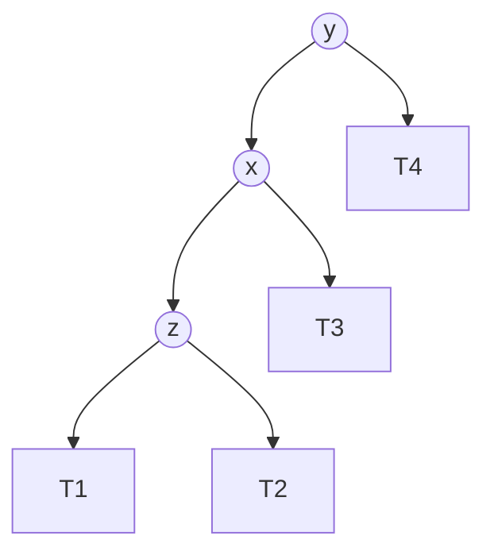
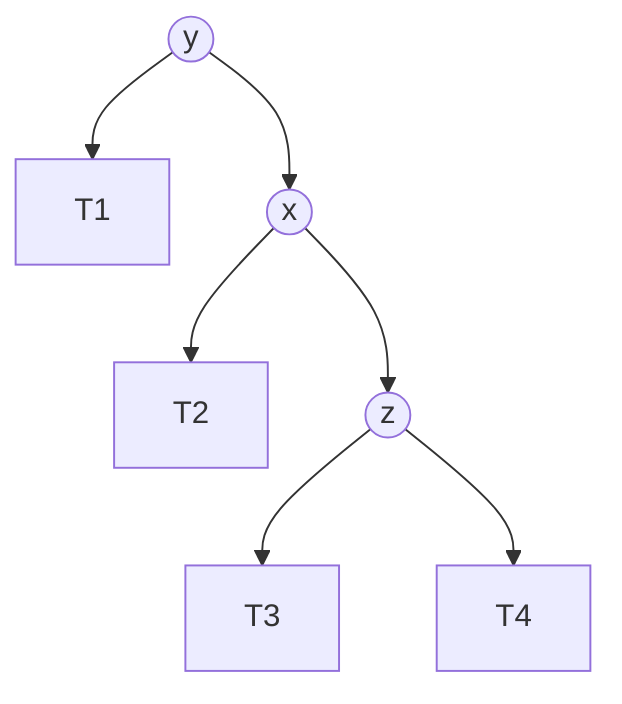
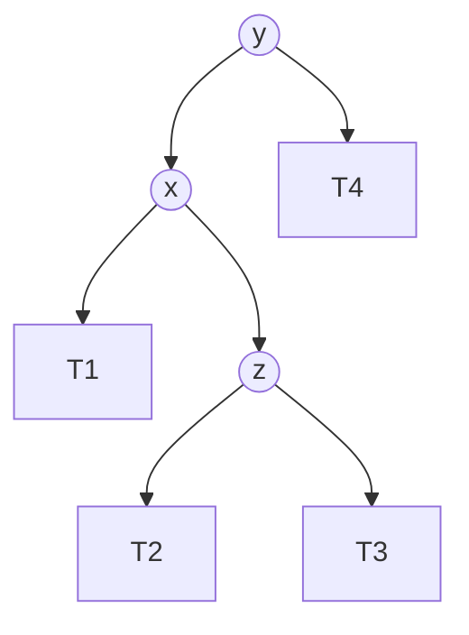
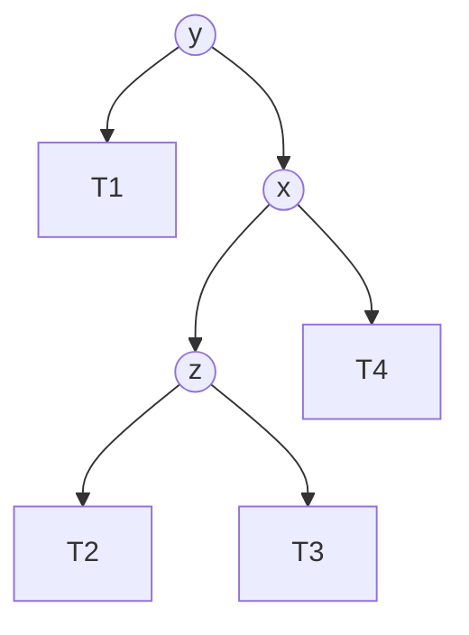

# 4种失衡情况

把 [definition.md](definition.md) 中"情形 1.1/1.2/2.1/2.2"对应到课件里常用的 LL/RR/LR/RL 命名，并给出判定流程和树形图例，方便速查。

注：下面的平衡因子符号统一沿用 [definition.md](definition.md) 的定义 BF(n) = n.right.height − n.left.height（右减左）。有些课件用的是"左减右"，符号正好相反，换算时不要直接照抄——本文已经按这个符号统一换算过，和 [implementation.md](implementation.md) 里 `fix_imbalance` 的 `balance_factor == -2/2` 分支是对得上的。

## 类型速查表

| 类型 | 对应情形 | 失衡结点 y 的 BF | y 偏重一侧的子节点 x 的 BF | 解决方法 |
|---|---|---|---|---|
| LL | 情形 2.1 | −2 | x（y 的左孩子）BF = −1 | 单次 right rotation（右旋） |
| RR | 情形 1.1 | +2 | x（y 的右孩子）BF = +1 | 单次 left rotation（左旋） |
| LR | 情形 2.2 | −2 | x（y 的左孩子）BF = +1 | 先对 x 做 left rotation，再对 y 做 right rotation（左旋左孩子，然后右旋） |
| RL | 情形 1.2 | +2 | x（y 的右孩子）BF = −1 | 先对 x 做 right rotation，再对 y 做 left rotation（右旋右孩子，然后左旋） |

## 判定流程

根据失衡结点 y 与其偏重一侧子节点 x 的平衡因子符号，两步判断具体属于哪种类型：

- y.BF = −2（y 左重）→ 看 x = y.left 的 BF
  - x.BF = −1 → **LL 型**
  - x.BF = +1 → **LR 型**
- y.BF = +2（y 右重）→ 看 x = y.right 的 BF
  - x.BF = +1 → **RR 型**
  - x.BF = −1 → **RL 型**

对应 [implementation.md](implementation.md) 里 `fix_imbalance` 的写法：先判断 `D.balance_factor`（对应 y.BF）的符号选左/右两支，再判断 `D.left`/`D.right` 那一侧子节点的高度关系（等价于判断 x.BF 的符号），从而在单旋转和双旋转之间选择。

## 树形图例

失衡前的树形（y 是失衡结点，x 是 y 偏重一侧的子节点，z 是新节点插入的那一侧、导致失衡的孙节点；T1~T4 是保持不变的子树）：

**LL**（z 是 x 的左孩子）

**RR**（z 是 x 的右孩子，是 LL 的镜像）

**LR**（x 是 y 的左孩子，z 是 x 的右孩子）

**RL**（x 是 y 的右孩子，z 是 x 的左孩子，是 LR 的镜像）

